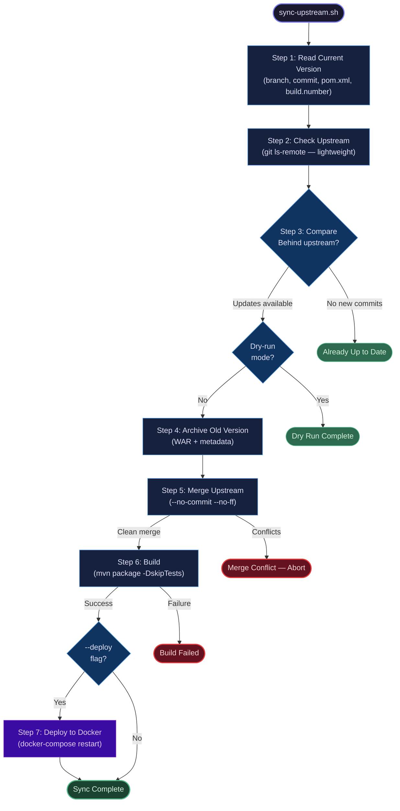

# UniTime Upstream Sync — Script Schema

> **Script:** `sync-upstream.sh` (278 lines)
> **Purpose:** Automated fork maintenance for the DigiPen UniTime deployment
> **Repository:** `unitime-master/`

---

## Overview

`sync-upstream.sh` keeps DigiPen's forked UniTime repository synchronized with the official upstream (`github.com/UniTime/unitime`). It detects new upstream commits, archives the current build, merges changes, rebuilds the WAR artifact, and optionally redeploys to a local Docker environment. The script is designed to be safe: it aborts cleanly on merge conflicts, preserves the old version in an archive, and never leaves the repository in a dirty state.

---

## Modes of Operation

| Mode | Flag | Behavior | Stops After |
|------|------|----------|-------------|
| **Sync + Build** | *(none)* | Check upstream, merge, build WAR | Step 6 (Build) |
| **Sync + Deploy** | `--deploy` | Check upstream, merge, build WAR, deploy to Docker | Step 7 (Deploy) |
| **Dry Run** | `--dry-run` | Check upstream, report status only | Step 3 (Compare) |

---

## High-Level Flowchart

---

## Detailed Flowchart

```mermaid
flowchart TD
    classDef startEnd fill:#1a1a2e,color:#e0e0ff,stroke:#7c7cf0,stroke-width:2px
    classDef step fill:#16213e,color:#e0e0ff,stroke:#5599dd,stroke-width:1px
    classDef io fill:#1b2838,color:#c8e6ff,stroke:#4a90d9,stroke-width:1px,stroke-dasharray:5 5
    classDef decision fill:#0f3460,color:#e0e0ff,stroke:#5599dd,stroke-width:1px
    classDef exitOk fill:#1b4332,color:#d8f3dc,stroke:#52b788,stroke-width:2px
    classDef exitErr fill:#641220,color:#ffd6d6,stroke:#e5383b,stroke-width:2px
    classDef warning fill:#5c4b00,color:#fff3b0,stroke:#e6c619,stroke-width:1px
    classDef deploy fill:#3a0ca3,color:#e0cffc,stroke:#7b2cbf,stroke-width:1px

    START([sync-upstream.sh invoked]):::startEnd

    %% --- Flag Parsing ---
    PARSE["Parse CLI flags<br/>--deploy | --dry-run | --help"]:::step
    HELP_CHECK{"--help<br/>or -h?"}:::decision
    HELP_EXIT(["Print usage — exit 0"]):::exitOk
    UNKNOWN_CHECK{"Unknown<br/>flag?"}:::decision
    UNKNOWN_EXIT(["Print error — exit 1"]):::exitErr

    START --> PARSE --> HELP_CHECK
    HELP_CHECK -- "Yes" --> HELP_EXIT
    HELP_CHECK -- "No" --> UNKNOWN_CHECK
    UNKNOWN_CHECK -- "Yes" --> UNKNOWN_EXIT
    UNKNOWN_CHECK -- "No" --> SETUP_LOG

    %% --- Logging Setup ---
    SETUP_LOG["Create logs/ directory<br/>Open timestamped log file"]:::io

    %% --- Step 1 ---
    S1["Step 1: Read Current Version"]:::step
    S1_IO[/"Read: git branch, git rev-parse<br/>Read: pom.xml → version<br/>Read: build.number → build #"/]:::io

    SETUP_LOG --> S1 --> S1_IO

    %% --- Step 2 ---
    S2["Step 2: Check Upstream Remote"]:::step
    S2_LS["git ls-remote upstream<br/>(lightweight — no full fetch)"]:::step
    S2_TAG["git ls-remote --tags<br/>→ latest upstream tag"]:::step
    REACH_CHECK{"Upstream<br/>reachable?"}:::decision
    REACH_FAIL(["ERROR: Cannot reach upstream — exit 1"]):::exitErr

    S1_IO --> S2 --> S2_LS --> REACH_CHECK
    REACH_CHECK -- "No" --> REACH_FAIL
    REACH_CHECK -- "Yes" --> S2_TAG

    %% --- Step 3 ---
    S3["Step 3: Compare Commits"]:::step
    SAME_CHECK{"Local commit<br/>== upstream<br/>commit?"}:::decision
    SAME_EXIT(["Already up to date — exit 0"]):::exitOk

    S2_TAG --> S3 --> SAME_CHECK
    SAME_CHECK -- "Identical" --> SAME_EXIT
    SAME_CHECK -- "Different" --> FULL_FETCH

    FULL_FETCH["git fetch upstream master<br/>(full fetch — downloads objects)"]:::step
    COUNT["Calculate BEHIND and AHEAD<br/>(git rev-list --count)"]:::step
    BEHIND_CHECK{"BEHIND<br/>== 0?"}:::decision
    BEHIND_EXIT(["All upstream changes present — exit 0"]):::exitOk

    FULL_FETCH --> COUNT --> BEHIND_CHECK
    BEHIND_CHECK -- "Yes (only ahead)" --> BEHIND_EXIT
    BEHIND_CHECK -- "No (updates exist)" --> SHOW_CHANGES

    SHOW_CHANGES["Show changed files summary<br/>(first 30 of N files)"]:::step
    DRY_CHECK{"--dry-run<br/>mode?"}:::decision
    DRY_EXIT(["DRY RUN COMPLETE — exit 0"]):::exitOk

    SHOW_CHANGES --> DRY_CHECK
    DRY_CHECK -- "Yes" --> DRY_EXIT
    DRY_CHECK -- "No" --> S4

    %% --- Step 4 ---
    S4["Step 4: Archive Old Version"]:::step
    S4_MKDIR["Create archives/vVER.BUILD_DATE/"]:::io
    WAR_CHECK{"target/UniTime.war<br/>exists?"}:::decision
    WAR_COPY["Copy WAR to archive dir"]:::io
    WAR_SKIP["Log: no WAR to archive"]:::warning
    S4_META[/"Write: version-info.txt<br/>(version, branch, commit, date, reason)"/]:::io

    S4 --> S4_MKDIR --> WAR_CHECK
    WAR_CHECK -- "Yes" --> WAR_COPY --> S4_META
    WAR_CHECK -- "No" --> WAR_SKIP --> S4_META

    %% --- Step 5 ---
    S5["Step 5: Merge Upstream"]:::step
    MERGE_CMD["git merge --no-commit --no-ff<br/>upstream/master"]:::step
    MERGE_CHECK{"Merge<br/>result?"}:::decision

    S4_META --> S5 --> MERGE_CMD --> MERGE_CHECK

    CONFLICT_LIST["List conflicting files<br/>Print resolution instructions"]:::exitErr
    MERGE_ABORT["git merge --abort<br/>(restore clean state)"]:::step
    CONFLICT_EXIT(["MERGE CONFLICT — exit 1"]):::exitErr

    MERGE_CHECK -- "Conflicts" --> CONFLICT_LIST --> MERGE_ABORT --> CONFLICT_EXIT

    MERGE_COMMIT["git commit<br/>'Merge upstream UniTime vX.X (hash)'"]:::step
    MERGE_CHECK -- "Clean" --> MERGE_COMMIT

    %% --- Step 6 ---
    S6["Step 6: Build"]:::step
    MVN["mvn package -DskipTests<br/>(output → log file)"]:::step
    BUILD_CHECK{"Build<br/>succeeded?"}:::decision
    BUILD_FAIL_MSG["Print: check log file<br/>Suggest: git reset --hard HEAD~1"]:::exitErr
    BUILD_EXIT(["BUILD FAILED — exit 1"]):::exitErr

    MERGE_COMMIT --> S6 --> MVN --> BUILD_CHECK
    BUILD_CHECK -- "Failure" --> BUILD_FAIL_MSG --> BUILD_EXIT

    BUILD_OK["Read new version + build number<br/>from pom.xml and build.number"]:::io
    BUILD_CHECK -- "Success" --> BUILD_OK

    %% --- Step 7 ---
    DEPLOY_CHECK{"--deploy<br/>flag set?"}:::decision
    S7["Step 7: Deploy to Docker"]:::deploy
    DOCKER_DIR_CHECK{"Docker dir<br/>exists?"}:::decision
    DOCKER_MISSING(["ERROR: Docker dir not found — exit 1"]):::exitErr

    BUILD_OK --> DEPLOY_CHECK
    DEPLOY_CHECK -- "No" --> SUMMARY
    DEPLOY_CHECK -- "Yes" --> S7 --> DOCKER_DIR_CHECK
    DOCKER_DIR_CHECK -- "No" --> DOCKER_MISSING

    WAR_DEPLOY["Copy WAR → Docker web/ volume"]:::io
    DOCKER_RESTART["docker-compose down<br/>docker-compose build unitime-web<br/>docker-compose up -d"]:::deploy
    VERIFY["Print: verify at<br/>http://localhost:8888"]:::deploy

    DOCKER_DIR_CHECK -- "Yes" --> WAR_DEPLOY --> DOCKER_RESTART --> VERIFY --> SUMMARY

    %% --- Summary ---
    SUMMARY["Print Summary:<br/>old version → new version<br/>archive path, log path"]:::step
    DONE(["SYNC COMPLETE — exit 0"]):::exitOk

    SUMMARY --> DONE
```

---

## Key Artifacts

| Artifact | Path | Created When | Contents |
|----------|------|-------------|----------|
| **Log file** | `logs/sync-YYYY-MM-DD_HH-MM-SS.log` | Every run | Timestamped record of all actions and command output |
| **Archive directory** | `archives/vVER.BUILD_DATE/` | Step 4 (non-dry-run) | Previous WAR + metadata |
| **Archived WAR** | `archives/vVER.BUILD_DATE/UniTime.war` | Step 4 (if WAR existed) | Pre-update WAR binary for rollback |
| **Version metadata** | `archives/vVER.BUILD_DATE/version-info.txt` | Step 4 | Version, branch, commit, timestamp, reason |
| **Built WAR** | `target/UniTime.war` | Step 6 (build success) | New deployable artifact |
| **Docker WAR copy** | `../New folder/web/UniTime.war` | Step 7 (deploy mode) | WAR placed into Docker build context |

---

## Exit Codes

| Code | Meaning | When |
|------|---------|------|
| `0` | Success or no action needed | `--help`, already up to date, dry run complete, sync complete |
| `1` | Error or manual intervention required | Unknown flag, upstream unreachable, merge conflict, build failure, Docker dir missing |

---

## Prerequisites

| Requirement | Needed For | How to Verify |
|-------------|-----------|---------------|
| `upstream` git remote configured | Steps 2-5 | `git remote -v` |
| Internet connection | Steps 2-3 | `git ls-remote upstream` |
| Maven installed | Step 6 | `mvn --version` |
| Docker + docker-compose | Step 7 only | `docker --version` |
| `../New folder/` directory | Step 7 only | `ls ../New\ folder/` |
| Clean working tree (no uncommitted changes) | Steps 5-6 | `git status` |
